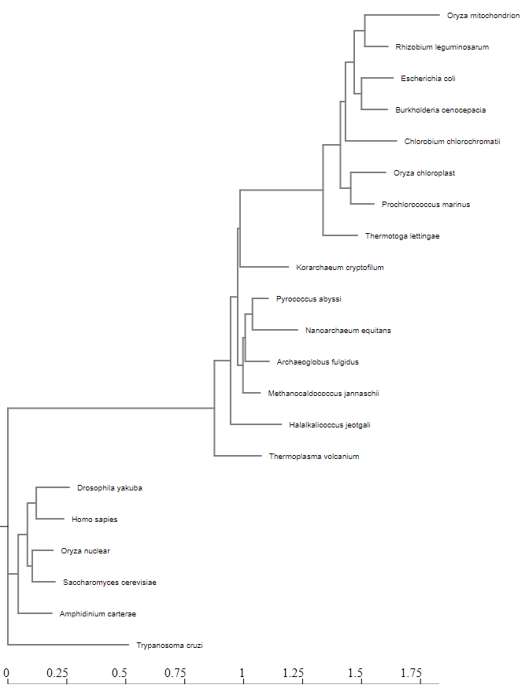

# NGPhylogeny.fr


# ggtree tutorial
```{r, message = FALSE, error = FALSE}
library(tidyverse)
library(ggtree)
library(treeio)
library(ggimage)
```

**basic trees**
```{r}
tree <- read.tree("data/tree_newick.nwk")
tree
```
```{r}
ggplot(tree)+
  geom_tree() +
  theme_tree2() 

ggtree(tree, branch.length = "none")

ggtree(tree, branch.length = "none", color = "blue", size = 2, linetype = 3)
```

# Exercise 1
```{r}
ggtree(tree, layout = "slanted")

ggtree(tree, layout = "circular")

ggtree(tree, branch.length = "none", color = "red2", size = 2, layout = "circular")
```

**other tree geoms**
```{r}
p <- ggtree(tree)

p + geom_nodepoint() + geom_tippoint() + geom_tiplab()
```

# Exercise 2
```{r}
ggtree(tree) +
  geom_nodepoint(color = "yellow2", size = 4, alpha = 0.5) +
  geom_tippoint(color = "purple", fill = "purple", shape = 23) +
  geom_tiplab(color = "purple") +
  ggtitle("Mihi arborum")
```

**tree annotation**
```{r}
ggtree(tree) + geom_text(aes(label = node), hjust= -.3)

ggtree(tree) + geom_tiplab()

MRCA(tree, c("C", "E"))

MRCA(tree, c("G", "H"))
```

